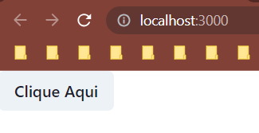

# Design System - Exercício

## Índice

-   [1. Documentação](#documentação)
-   [2. Exercício 1](#exercício-1)
-   [3. Exercício 2](#exercício-2)
-   [4. Exercício 3](#exercício-3)

## Documentação

[Documentação do ChakraUI](https://chakra-ui.com/getting-started)<br>
[Templates do ChakraUI](https://chakra-templates.dev/components/cards)

## Exercício 1

### Enunciado

No primeiro exercício vamos praticar a instalação e configuração do ChakraUI.

-   Instale o React
-   Instale o ChakraUI
-   Configure o Provider no App
-   Implemente um botão do Chakra no App para confirmar que tudo está funcionando

### Resolução

-   Instale o React [✔]

    ```
    npx create-react-app nome-da-pasta
    ```

-   Instale o ChakraUI [✔]

    ```
    npm install @chakra-ui/react @emotion/react @emotion/styled framer-motion react-icons
    ```

-   Configure o Provider no App [✔]

    1. Dentro do `index.js` importei o `ChakraBaseProvider` e o `theme`:

        ```
        (...)
        import { ChakraBaseProvider, theme } from '@chakra-ui/react';
        (...)
        ```

    2. Chamei o `ChakraBaseProvider` e o `theme` como prop desse componente:

        ```
        (...)
        <ChakraBaseProvider theme={theme}>
           <App />
        </ChakraBaseProvider>
        (...)
        ```

-   Implemente um botão do Chakra no App para confirmar que tudo está funcionando

    1. No `App.js` importei um botão e o chamei dentro do componente:

        ```
        import { Button } from '@chakra-ui/react';

        function App() {
           return (
              <div>
                    <Button>Clique Aqui</Button>
              </div>
           );
        }

        export default App;
        ```

    2. Obtive o seguinte resultado:
       

## Exercício 2

### Enunciado

Agora vamos utilizar um template pronto de Card no Chakra e implementá-lo.

-   Acesse o link dos templates de Card do Chakra no README do repositório (ou clique [aqui](https://chakra-templates.dev/components/cards))
-   Escolha um dos Cards prontos e implemente-o em um arquivo separado e chame-o no seu App (pode ser igual o da aula)
-   Teste tudo e confirme que está funcionando

### Resolução

1. Em `src` criei uma pasta chamada `Components` dentro dela um arquivo chamado `Card.js`
2. Escolhi um card do link mencionado e copiei o código de um deles e colquei dentro de `Card.js`
3. Importei e chamei o componente pelo nome identificado no próprio código copiado do Chakra UI dentro do `App.js`:

    ```
    import PostWithLike from './Components/Card';

    function App() {
       return (
          <div>
                <PostWithLike />
          </div>
       );
    }

    export default App;
    ```

## Exercício 3

### Enunciado

Para finalizar, crie um array com no mínimo 3 itens, baseado no Card que você implementou.
<br><br>
Por exemplo: se escolheu o Card de produtos (Product Simple), então o array guardará objetos com propriedades brand (marca), name (nome), priceDescount (preço com desconto) e priceNormal (preço normal).
<br><br>
Não iremos utilizar o axios nesse exercício, por isso vamos criar nosso próprio array de dados.

-   Você pode decidir se vai deixar o array em um arquivo separado e exportá-lo, ou então criá-lo direto no App.js
-   Crie um estado e coloque seu array como valor inicial (não se preocupe em utilizar a função de atualização)
-   Mapeie o estado, retornando o Card passando as props necessárias para personalização
-   Edite o Card para receber as props e utilizá-las em seu interior

### Resolução

1. Dentro de `src` criei uma pasta chamada `mock` e dentro dela um arquivo chamado `courses.js` dentro desse arquivo um array com essa estrutura:

    ```
    export const courses = [
      {
         id: 1,
         language: 'JavaScript',
         nameCourse: 'React',
         valueCourse: 500.0,
         description:
         'Curso de React para iniciantes. Aprenda a criar aplicações web modernas usando o React.js.',
      },
    (...)
    ```

2. Importei esse array no `App.js` da seguinte forma (precisa de chaves):
    ```
    import { courses } from './mock/courses';
    ```
3. Depois um console para ver se estava funcionando:

    ```
    (...)
    function App() {
       console.log(courses);
       return (
    (...)
    ```

4. Em seguida fiz um map do meu array no qual agora retornava o componente com as props `key` e `course`:

    ```
    import PostWithLike from './Components/Card';
    import { courses } from './mock/courses';

    function App() {
       // console.log(courses);
       return (
          <div>
                {courses.map((course) => {
                   return <PostWithLike key={course.id} course={course} />;
                })}
          </div>
       );
    }

    export default App;
    ```

5. Recebi `course` na função `PostWithLike` do arquivo `Card.js`:

    ```
    (...)
    export default function PostWithLike({ course }) {
    (...)
    ```

6. Adaptei as partes que eu queria que recebesse as informações do meu mock:

-   Para que as imagens fossem variadas usei essa url:

    ```
    `https://picsum.photos/seed/${user.id}/200/200`
    ```

-   A url mencionada anteriormente foi colocada aqui:

        ```
        
        ```

-   Coloquei a tag com o nome da Lingugem, o nome do curso, a descrição e o valor. Também adaptei a fonte em string pré-definida, segue o código modificado e uma lista com o tamanho das fontes possíveis:

-   Código:

    ```
      <Text fontSize={'xs'} fontWeight="medium">
         {course.language}
       </Text>
       <Heading color={'black'} fontSize={'2xl'} noOfLines={1}>
         {course.nameCourse}
       </Heading>
       <Heading color={'black'} fontSize={'md'} noOfLines={1}>
         {`R$ ${course.valueCourse}`}
       </Heading>
       <Text color={'gray.500'} noOfLines={2}>
         {course.description}
      </Text>
    ```

-   Lista dos tamanhos de fonte pré-definidos do Chakra UI, em ordem do menor para o maior:

    ```
    1. 'xs' - Extra Small
    2. 'sm' - Small
    3. 'md' - Medium
    4. 'lg' - Large
    5. 'xl' - Extra Large
    6. '2xl' - 2x Extra Large
    7. '3xl' - 3x Extra Large
    8. '4xl' - 4x Extra Large
    9. '5xl' - 5x Extra Large
    10. '6xl' - 6x Extra Large
    11. '7xl' - 7x Extra Large
    12. '8xl' - 8x Extra Large
    ```
